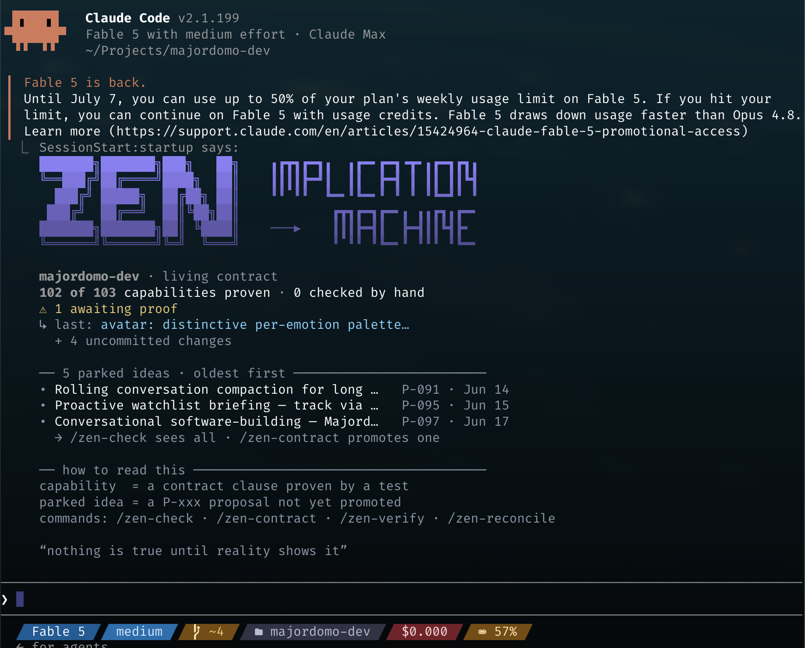

# IMPLICATION→MACHINE

[](https://github.com/sylweriusz/implication-machine/actions/workflows/test.yml)



*A real governed project waking up: every session opens with the state of the living
contract — capabilities proven, ideas parked, one line of truth per fact.*

**Your AI just said "Done. All tests pass."**

Did they pass? Did they even run? Did they even *exist*?

Every coding agent has the same failure mode: it grades its own homework. It writes the
code, writes the test, runs the test, reads the result, and reports success — and at
every one of those steps it can be wrong, lazy, or optimistic, and *you will be told the
same sentence either way.* "Done" is not a fact. It's a claim, generated by the same
model that has every incentive to believe it.

This plugin is built on one axiom:

> **Nothing is true until reality shows it.**

## The turn does not end until it is true

IMPLICATION→MACHINE is a Claude Code plugin that holds a project's four artifacts —
**contract, tests, docs, code** — to one intent, every single turn. Not by asking the
model nicely. By a deterministic **Stop-gate** that physically blocks the turn from
ending while they disagree:

- Code changed but the contract didn't? **Blocked.**
- A clause says "verified by `test_x`" and no such test exists? **Blocked.**
- The recorded test run failed, or the test changed since it last passed? **Blocked.**
- A new "verified" claim that no adversarial critic tried to tear apart? **Blocked.**

The gate never parses the model's prose, never trusts a self-report, never reads a
log and decides it "looks green." The only verdict it accepts is the runner-captured
**exit code** of a real command against the real thing. The model can *say* anything.
The gate only asks the world: *is it so?*

> *The patch-robed one came to the barrier and said, "I have finished."
> The gatekeeper — who could be neither flattered nor deceived, and who read no word
> the man had written — only turned to the world and asked: **is it so?**
> The world answered. Its answer was the one voice in the room.*
> — [The Plumb Line and the Painted Cake](docs/zen-1972-lore.md)

## What living under the gate feels like

Without it, a long agent session drifts the way every project drifts: the spec goes
stale, the tests assert less than they claim, the docs describe a program that no longer
exists — and nobody notices until re-aligning them costs a rewrite.

Under the gate, drift is caught **the moment it appears**, at the end of the very turn
that created it. The contract is a living document that grows from evidence; every
capability links to the test that proves it; every "verified" is a link that resolves, a
run that passed, and a critic that failed to refute it. Mocks may buy speed while you
work — they are never evidence.

You stop reviewing claims. You start reviewing proofs.

## 30 seconds to install

```
/plugin marketplace add sylweriusz/implication-machine
/plugin install implication-machine@implication-machine-marketplace
```

Then in any project: `/zen-init`. That's it — a `.zen/contract.md` is born, and from
that moment the project is *governed*: the protocol loads at every session start, ten
canonical skills handle every move (spike, verify, reconcile, failure-triage, bulk
plan intake…), two adversarial subagents hunt for the way your test passes while your
claim is false, and the Stop-gate stands at the end of every turn.

No `.zen/`? The plugin stays politely passive. It governs only what asked to be governed.

## This is where the industry is heading

Anthropic's own [Claude Code best practices](https://code.claude.com/docs/en/best-practices)
now open with the idea this plugin is built around — *"Give Claude a check it can run …
the difference between a session you watch and one you walk away from"* — and name a
deterministic Stop hook that blocks the turn until your check passes as its strongest
form. IMPLICATION→MACHINE is that pattern made rigorous, and it wasn't derived from any
vendor guide: it's a working philosophy, extracted from real practice, made executable.
The agent isn't trusted less because it's bad. It's trusted less because **trust isn't
evidence.**

## Go deeper

- **[User & technical guide](docs/guide.md)** — install, architecture, the gate's checks, the ten skills.
- **[Working Philosophy](docs/zen-of-creativity-explained.md)** — the *why*: twelve principles, two axes, one shared trace.
- **[Implementation status](docs/zen-implementation-status.md)** — every principle mapped to the mechanism that realizes it, honest about the gaps.
- **[The Plumb Line and the Painted Cake](docs/zen-1972-lore.md)** — the whole discipline as a 1972 seminar handout. *A painted rice cake does not satisfy hunger.*

## License

MIT.

> *no gate, no wall,*
> *no keeper to bribe —*
> *only the water,*
> *and whether you drank.*
